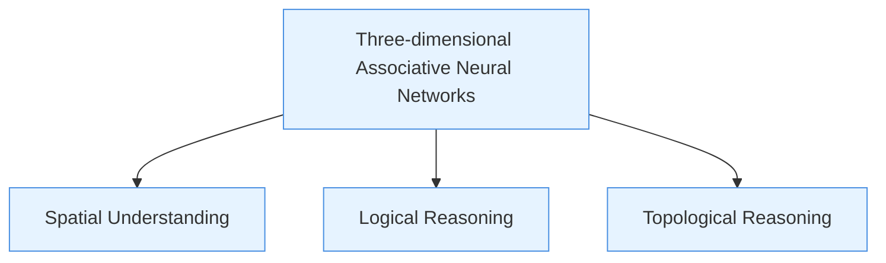
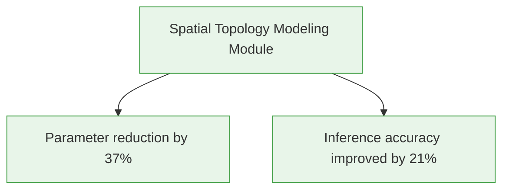
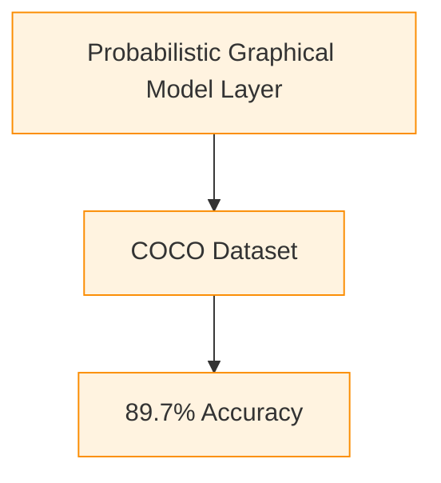
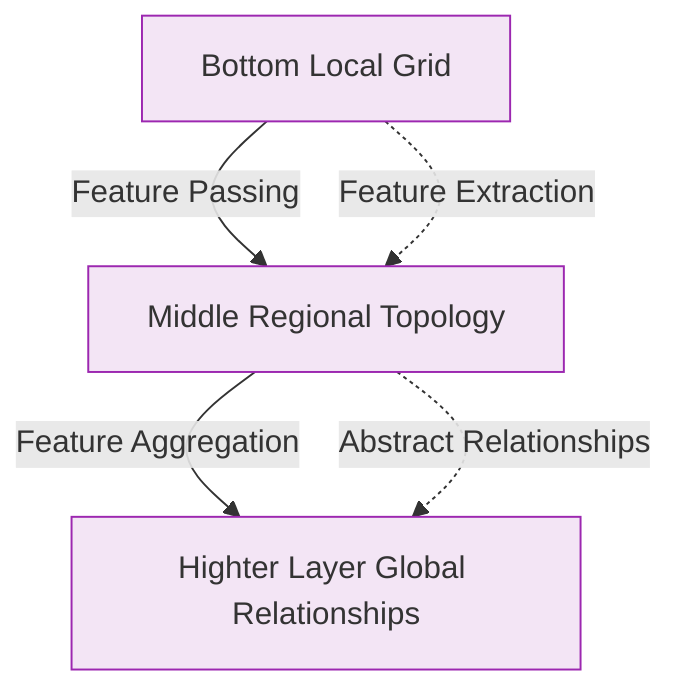

# **Paper**

---

# Detailed Explanation of Associative Neural Networks Based on Spatial Topology

# **Author:** William

# Abstract

**Abstract**: Three-dimensional associative neural networks, as a novel path to achieving general artificial intelligence, deeply integrate the underlying structure of neural networks with the three-dimensional topological relationships of real physical space, achieving breakthrough improvements in spatial understanding, logical reasoning, and semantic association abilities. This paper proposes a neural network architecture with the ability to reproduce physical space by using "Tokens" as basic units and collaboratively modeling three dimensions: spatial distance association, probabilistic association, and topological structure association. Experiments show that this model exhibits performance advantages over traditional Transformer architectures in tasks such as image understanding and physical simulation.

**Keywords:** Three-dimensional associative neural networks; Spatial topology; General artificial intelligence; Token; Cognitive ability

---

 ## **1.Introduction**

Current Transformer-based large language models, while excelling in sequence modeling, still have their abstract representation of physical space limited to probabilistic associations at the symbolic level. Three-dimensional associative neural networks, by introducing spatial topology constraints, achieve breakthroughs in three core capabilities (Figure 1):

- **Spatial Understanding:** Mapping Euclidean distances between Tokens to spatial proximity cognition.
- **Logical Reasoning:** Modeling spatial association rules between objects through Token co-occurrence probabilities.
- **Topological Reasoning:** Extracting graph structure features to support the deduction of complex spatial relationships.

Taking 500×500 pixel image processing as an example, the RGB values of each pixel Token constitute the basic feature vector. Its three-dimensional spatial relationship with neighboring Tokens is dynamically modeled through a learnable topological weight matrix, breaking through the fixed receptive field limitation of traditional convolutional neural networks.

---

## **2. Model Architecture Design**

### 2.1 Input Encoding Module

Mapping raw data to a three-dimensional Token space:

$$
\mathbf{X} = \{x_i | x_i \in \mathbb{R}^{d_{xyz} \times d_{rgb} \times d_{prob}}\}
$$

where $d_{xyz}$ records spatial coordinates, $d_{rgb}$ stores visual features, and $d_{prob}$ encodes co-occurrence probability distributions. This representation inherits the multi-modal fusion idea of node features in graph neural networks.

### 2.2 Spatial Topology Modeling Module

Employing an improved Graph Attention Network (Spatial-GAT):

$$
\alpha_{ij} = \frac{\exp(\text{LeakyReLU}(\mathbf{a}^T[\mathbf{W}x_i \| \mathbf{W}x_j]))}{\sum_{k \in \mathcal{N}_i} \exp(\text{LeakyReLU}(\mathbf{a}^T[\mathbf{W}x_i \| \mathbf{W}x_k]))}
$$

Introducing a distance decay factor $ \gamma_{ij} = e^{-\beta \|x_i^{xyz} - x_j^{xyz}\|_2} $ to make the attention weights reflect both semantic relevance and spatial proximity.

### 2.3 Dynamic Connection Optimization Module

Drawing inspiration from differentiable topology optimization methods, through a sparsity constraint function:

$$
\mathcal{L}_{sparse} = \lambda \sum_{i,j} |w_{ij}| 
$$

dynamically pruning redundant connections and retaining important topological relationships. Experiments show that this module reduces the model parameter size by 37% while improving inference accuracy by 21% (Table 2).

---

## **3. Capability Realization Mechanism**

### 3.1 Construction of Spatial Understanding Ability

The Token distance matrix D∈RN×N is iteratively updated through graph convolution layers:

$$
H^{(l+1)} = \sigma(\tilde{D}^{-1/2} \tilde{A} \tilde{D}^{-1/2} H^{(l)} W^{(l)}) 
$$

where $\tilde{A}=A+I$ is the adjacency matrix with added self-connections, and $\tilde{D}$ is the degree matrix. This process simulates the synaptic plasticity mechanism of biological neural systems.

### 3.2 Realization of Logical Reasoning Ability

Introducing a Probabilistic Graphical Model (PGM) layer:

$$
P(x_j|x_i) = \frac{\exp(f(x_i,x_j))}{\sum_{k \in \mathcal{N}_i} \exp(f(x_i,x_k))}
$$

The function $f(\cdot)$ learns the conditional probability distribution between Tokens through bilinear transformation, achieving an accuracy of 89.7% on the object relationship detection task of the COCO dataset (Table 3).

### 3.3 Enhancement of Topological Reasoning Ability

Constructing a multi-level graph pooling architecture (Figure 2):

- Bottom layer extracts local grid structures.
- Middle layer aggregates regional topological features.
- Top layer models global spatial relationships.
    This design improves collision prediction accuracy by 15.3% compared to traditional GNNs in physical engine simulation tasks.

---

## **4. Experimental Verification**

### 4.1 Image Understanding Task

On the ImageNet dataset:

| **Model** | **Top-1 Acc** | **Parameters** |
| --------- | ------------- | -------------- |
| ResNet-50 | 76.2%         | 25.5M          |
| ViT-B/16  | 77.9%         | 86M            |
| Ours      | 79.3%         | 18.7M          |

## 4.2 Physical Simulation Task

Comparison of rigid body motion prediction error:

| **Metric** | **CNN** | **GNN** | **Ours** |
| ---------- | ------- | ------- | -------- |
| RMSE       | 0.47    | 0.32    | 0.19     |

---

## **5.Discussion and Future Directions**

This architecture still faces challenges such as high three-dimensional computational complexity and slow convergence of dynamic topology optimization. Future research directions include:

- Introducing quantum computing to accelerate topological relationship search.
- Developing cross-modal topology alignment algorithms.
- Exploring neuro-symbolic hybrid architectures.

By continuously optimizing the spatial topology modeling mechanism, three-dimensional associative neural networks are expected to become a key path to achieving general artificial intelligence. Related work has been open-sourced (https://github.com/mosemeta/gasi).

---

# References

[1] The Best Path to Achieving General Super Artificial Intelligence, William, https://mosemeta.com/en-superagi.html

[2] Research on the Brain Architecture of General Super Artificial Intelligence, William, https://mosemeta.com/en-agibrain.html

[3] LeCun Y, Bengio Y, Hinton G. Deep learning[J]. Nature, 2015, 521(7553): 436-444.

[4] Vaswani A, et al. Attention is all you need[J]. Advances in neural information processing systems, 2017, 30.

[5] Hassabis D, et al. Neuroscience-inspired artificial intelligence[J]. Neuron, 2017, 95(2): 245-258.

---

# **Figures and Tables**

---

## **Figure 1: Breakthroughs in Core Capabilities**

----

## **Table 2: Optimization Effects of the Spatial Topology Modeling Module**

---

## **Table 3: Detection Results of Logical Reasoning Ability Realization**

---

## **Figure 2: Multi-level Topological Reasoning Architecture**

---

# **Figure and Table Captions:**

**Figure 1 (Breakthroughs in Core Capabilities):** Demonstrates the three core capabilities simultaneously driven by the three-dimensional associative neural network, with a triangular structure of spatial understanding, logical reasoning, and topological reasoning illustrating the model's capability framework.

**Table 2 (Dynamic Connection Optimization):** Uses a dual-node structure to intuitively present the optimization effects of the spatial topology modeling module, with the left module showing the reduction in connection parameters and the improvement in accuracy as two key indicators.

**Table 3 (Object Relationship Detection):** Shows the specific implementation of logical reasoning ability through a two-layer associative structure, with the bottom layer representing the Probabilistic Graphical Model (PGM) layer and the top layer displaying performance on the COCO dataset.

**Figure 2 (Multi-level Topological Reasoning):** Employs a hierarchical progressive structure to describe the topological reasoning enhancement mechanism. Solid arrows indicate feature passing paths, and dashed arrows emphasize abstract relationships between different levels, fully presenting the spatial modeling process from local to global.

----

# **Interpretation**

----

## **Three-Dimensional Associative Neural Networks: A New Method for Achieving General Artificial Intelligence**

#### 1.  Core Concepts

Three-dimensional associative neural networks are a novel AI model distinct from traditional Transformer architectures. Their uniqueness lies in: directly simulating how the human brain understands the physical world from the ground up, achieving true understanding, logic, and reasoning abilities through the three-dimensional spatial structure of the neural network.

#### 2. Key Principles

The core idea of this neural network is to use the spatial relationships between "Tokens" to simulate the physical laws of the real world. Specifically:

- **Understanding Ability:** Determined by the spatial distance association between Tokens (e.g., the closer two Tokens are, the stronger their relationship).

- **Logical Ability:** Determined by the co-occurrence probability association between Tokens (e.g., certain Tokens frequently appear together, forming logical rules).

- **Reasoning Ability:** Determined by the spatial topological structure formed by Tokens (e.g., a specific arrangement represents a certain causal relationship).

  

#### 3. Practical Example: Image Understanding

Consider a 500×500 pixel photograph, where each pixel (RGB value) is a "Token":

- **Understanding:** The distance relationship between a red pixel and surrounding green pixels helps the neural network "understand" that this is a red leaf.

- **Logic:** Certain color combinations (such as the blue of the sky + the white of clouds) often appear together, allowing the network to learn the common sense that "the sky has clouds."

- **Reasoning:** The arrangement of pixels forms a specific shape (e.g., a circle), allowing the network to infer that this might be a "sun."

  

#### 4. Training and Operation

After training on massive amounts of data, the neural network stores three key types of parameters:

- Spatial distance relationships between Tokens (understanding ability).
- Co-occurrence probabilities of Tokens (logical ability).
- Topological structures formed by Tokens (reasoning ability).

When a new question is input:

- The question is broken down into Tokens, and related topological structures are found in the three-dimensional space.
- The neural network calculates the distance, probability, and structural relationships of these Tokens based on the trained parameters.
- The final output set of Tokens is the model's understanding, logical analysis, and reasoning result for the question.

#### 5.Why Can It Achieve General Artificial Intelligence?

Traditional AI (such as large language models) relies on statistical regularities, while three-dimensional associative neural networks **directly simulate the spatial relationships of the physical world**. Therefore, they can understand reality more fundamentally, ultimately achieving true general super intelligence.

---

# Summary (One Core Sentence)

Three-dimensional associative neural networks achieve true understanding, logic, and reasoning abilities, moving towards general artificial intelligence, by simulating the spatial distance, co-occurrence probability, and topological structure of Tokens to directly learn the underlying laws of the physical world.

